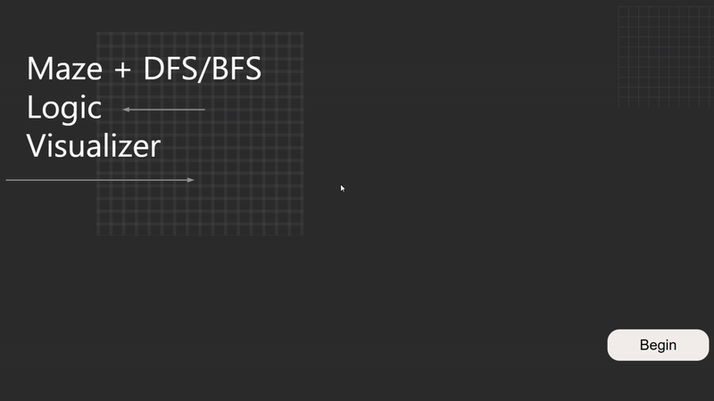
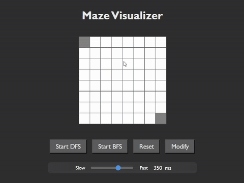
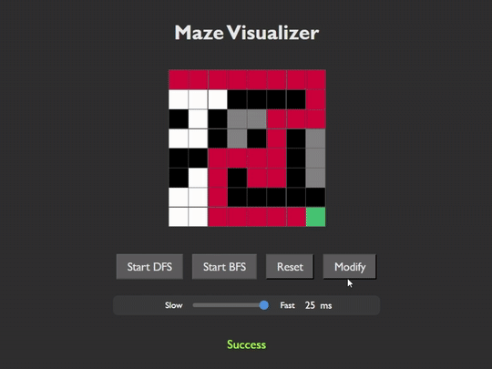
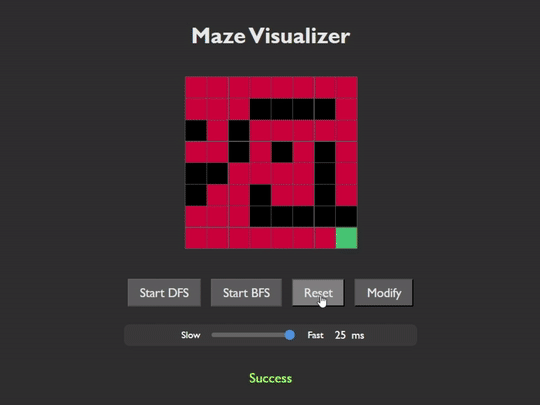

# Maze Visualizer

This project is a **maze pathfinding visualizer** developed by Group 8 for the NTU DSA 2025 Software Engineering Project.  
It allows users to design a maze and observe how **Depth-First Search (DFS)** and **Breadth-First Search (BFS)** algorithms explore and solve the maze through animated visual feedback.

---

## Features

1. Interactive maze grid with adjustable size (8×8, 10×10, 12×12)  
2. Place walls and obstacles manually  
3. Select between DFS and BFS algorithms  
4. Step-by-step animation showing algorithm progress  
5. Adjustable animation speed slider  
6. Visual legend:
- White: unvisited  
- Black: wall  
- Green: visiting  
- Red: visited  
- Lightskyblue: enqueued (BFS)  
- Gold outline: currently scanning

## Built With

* [![Python][Python.org]][Python-url]
* [![Flask][Flask.pallets]][Flask-url]
* [![HTML5][HTML5.badge]][HTML5-url]
* [![CSS3][CSS3.badge]][CSS3-url]
* [![JavaScript][JavaScript.badge]][JavaScript-url]

## How to Run

### Flask server (Backend)

1. Install required Python packages (Flask, flask-cors):
```bash
pip install Flask flask-cors
```

2. Navigate to the backend directory:
```bash
cd backend
```

3. Run the Flask server:
```bash
python app.py
```

The backend will start on `http://127.0.0.1:5000`.

### Visualizer (Frontend)

1. Open `index.html` in your web browser.  
2. Navigate through the interface:  
- Select a maze size  
- Place walls by clicking cells  
- Adjust speed if desired  
- Start visualization by clicking **Start DFS** or **Start BFS**


## Demo

Here’s a visual walkthrough of the Maze Visualizer in action.

### Choosing Maze Size


### Customizing the Maze


### Running and Adjusting Speed


### Modify Existing Maze


### Resetting the Maze



## License

This project is licensed under the MIT License.  
See the [LICENSE](./LICENSE) file for details.

<!-- MARKDOWN LINKS & IMAGES -->
<!-- https://www.markdownguide.org/basic-syntax/#reference-style-links -->

[Python.org]: https://img.shields.io/badge/Python-3776AB?style=for-the-badge&logo=python&logoColor=white
[Python-url]: https://www.python.org/

[Flask.pallets]: https://img.shields.io/badge/Flask-000000?style=for-the-badge&logo=flask&logoColor=white
[Flask-url]: https://flask.palletsprojects.com/

[HTML5.badge]: https://img.shields.io/badge/HTML5-E34F26?style=for-the-badge&logo=html5&logoColor=white
[HTML5-url]: https://developer.mozilla.org/en-US/docs/Web/Guide/HTML/HTML5

[CSS3.badge]: https://img.shields.io/badge/CSS3-1572B6?style=for-the-badge&logo=css3&logoColor=white
[CSS3-url]: https://developer.mozilla.org/en-US/docs/Web/CSS

[JavaScript.badge]: https://img.shields.io/badge/JavaScript-F7DF1E?style=for-the-badge&logo=javascript&logoColor=black
[JavaScript-url]: https://developer.mozilla.org/en-US/docs/Web/JavaScript
